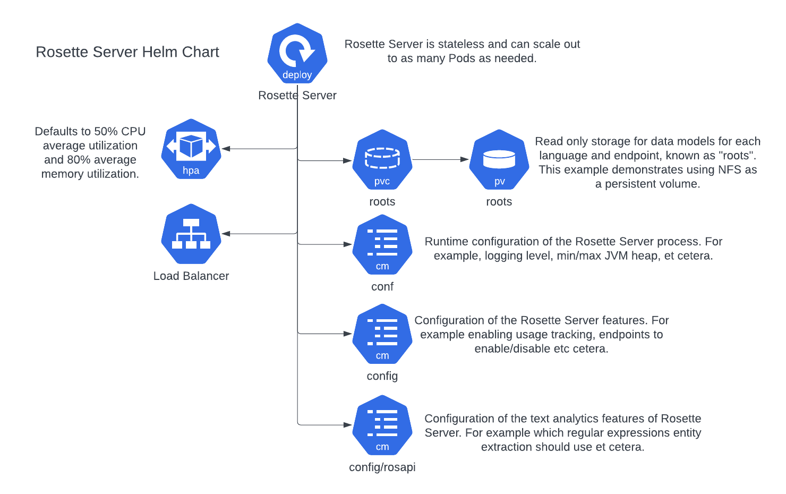

# Rosette Enterprise k8s Persistent Volume Deployment

## Support
For support issues, email [helpdesk@babelstreet.com](mailto:helpdesk@babelstreet.com) or visit [our support site](https://babelstreet.my.site.com/support/s/).

## Overview
This example project describes how to deploy Rosette Enterprise in *docker* and *helm*. 

The key components of the *helm* deployment is outlined below.
The Rosette Server image specified in the deployment will be deployed in one Pod. Horizontal scaling will be handled by a Horizontal Pod Autoscaler using CPU load and memory as a scaling metric. All Rosette Server configuration files and license file will be exposed to Pods using three ConfigMaps. One ConfigMap encapsulates the `./config` directory, another the `/config/rosapi` directory and the runtime configuration directory `./conf`. In this example a persistent volume hosted on NFS is being used.



This deployment of the Rosette Server has the following advantages:
1. The containers can start up faster since they do not need to unpack roots.
2. The containers are smaller and will not exceed any Docker limit on container size.
3. The Persistent Volume is mounted on each Node in the cluster so all Pods will have access to the roots.
4. The autoscaler will automatically add and remove Pods as needed.

## Deployment Outline
0. Obtain a Rosette Enterprise license file. This would have been part of your shipment email.
1. Decide on the persistent volume type to use and set it up. Note: for all endpoints and all languages you will need approximately 100G. 
2. Extract and configure the configuration files from Rosette Server as outlined in the [helm/rosette-server](helm/rosette-server) directory.
3. Download the compressed data models (roots) in preparation for deploying them to the persistent volume as outlined in the `helm/rosette-server` directory.
4. Create the ConfigMaps from the configuration files. 
5. Deploy the compressed data models and install them into the persistent volume. When copying the models it is often faster to copy the tar.gz roots from the downloaded models and then expanding them in the peristent volume target. Instructions for downloading models are in the `helm/rosette-server` directory. 
6. Deploy the Rosette Server deployment (following the helm).


## Persistent Volumes
There are several different types of persistent volumes that could be used instead of NFS but NFS was selected since it is ubiquitous. When copying the data models it is often faster to copy the tar.gz roots from the downloaded models and then expanding them in the peristent volume target. Please refer to the README in the `helm/rosette-server` directory for more information on downloading data models.

## Project Directory Structure

|Directory|Purpose|
|---------|-------|
|helm|This directory contains files that can be used to deploy Rosette Server in a k8s cluster using helm. In this configuration the models are hosted on using a Persistent Volume using an NFS share. Note: any Persistent Volume type can be used, Azure Disk, AWS EBS, GCP Persistent Disk, etc. The configuration files for Rosette Server are deployed as ConfigMaps.|
|rosette-server|This directory contains scripts for downloading Rosette Server configuration and data files for deployment to k8s or to run Rosette Server locally in docker.|
|||


These recipes have been validated on Google Kubernetes Engine but the concepts will be the same regardless.

## Appendix 

### NFS Server Creation

### Create NFS server virtual machine
This step is optional and is only required if an NFS server is not available in your environment. Please note, other file systems other than NFS can be used, however local attached storage should be avoided since local attached storage prevents moving Pods between Nodes. Please refer to the documentation on Persistent Volumes for more information. The concept for this example is that a virtual machine is created, started and then the roots are scp'd to the instance and served by NFS to all the Nodes in the cluster. Which roots to copy and where to find them will be described below.

A virtual machine is used since it more closely mimics NFS servers which are typically appliances or machines rather than containers. The VM created for the NFS Server in the Google Compute Engine used in this demo was n1-standard-1 (1 vCPU, 3.75 GB memory) with an attached 150G disk to serve roots based on a centos-7 image. Note, there are some containerized NFS servers that could be used if a container is required.

#### Setup of the VM
  Once the VM instance is created and started, perform the following (one time setup)

##### Setup the directory for the roots:
```
sudo mkdir -p /var/nfsshare/roots
sudo chmod -R 755 /var/nfsshare/roots
sudo chown nfsnobody:nfsnobody /var/nfsshare/roots
# Extract the roots to /var/nfsshare/roots, see the ./rosette-server/README
```
##### Create an NFS Server:
Note systemctl typically doesn't run in a container which is another reason a VM was selected (ease of deployment):
```
sudo yum install nfs-utils

sudo systemctl enable rpcbind
sudo systemctl enable nfs-server
sudo systemctl enable nfs-lock
sudo systemctl enable nfs-idmap

sudo systemctl start rpcbind
sudo systemctl start nfs-server
sudo systemctl start nfs-lock
sudo systemctl start nfs-idmap

# expose the nfsshares
sudo vi /etc/exports
/var/nfsshare		*(rw,sync,no_root_squash,no_all_squash)
/var/nfsshare/roots	*(rw,sync,no_root_squash,no_all_squash)
sudo systemctl restart nfs-server
```
##### Allow the NFS traffic through the firewall:
```
sudo firewall-cmd --permanent --zone=public --add-service=nfs
sudo firewall-cmd --permanent --zone=public --add-service=mountd
sudo firewall-cmd --permanent --zone=public --add-service=rpc-bind
```
##### Verify NFS is serving:
`showmount -e localhost`

### Use Helm to Deploy Rosette Enterprise
In order to use Helm a few configuration values in the values.yaml file need to be set. These are described in the [helm/rosette-server](helm/rosette-server) README. Once configured the Rosette Enterprise can be deployed with  `helm install demo ./rosent-server` from this directory.\


